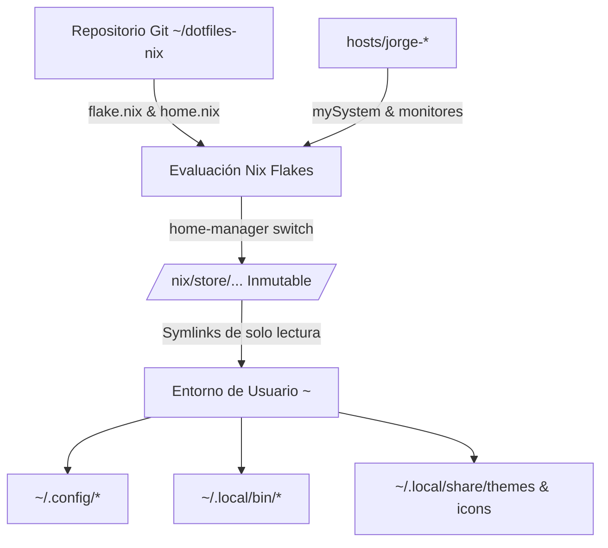

# 01 — Arquitectura del Sistema (Desktop IaC)

## 1. Filosofía de Ingeniería: Desktop Infrastructure as Code (Desktop IaC)

Este repositorio traslada los principios de la ingeniería de infraestructura en la nube (**IaC**, **GitOps**, **Idempotencia** e **Inmutabilidad**) a la gestión de estaciones de trabajo personales (laptops).

El objetivo es erradicar por completo el **desvío de configuración (*Configuration Drift*)**:
* Ningún cambio estético, de paquetes o de comportamiento se realiza directamente mediante clics o comandos manuales no reproducibles.
* La configuración completa reside en Git como fuente única de verdad (*Single Source of Truth*).
* Los archivos resultantes generados en el directorio de usuario (`~/.config/`, `~/.local/bin/`, etc.) son enlaces simbólicos de solo lectura que apuntan directamente a entradas criptográficamente verificadas dentro del **Nix Store** (`/nix/store/`).

---

## 2. Modelo Híbrido: Debian GNU/Linux + Nix Flakes Standalone

Una de las decisiones arquitectónicas más importantes de este entorno es el uso de **Home Manager en modo Standalone sobre Debian GNU/Linux**, en lugar de utilizar NixOS puro.

### Separación de Responsabilidades (*Separation of Concerns*)

| Capa | Administrador | Responsabilidad Técnica | Razón de Ingeniería |
| :--- | :--- | :--- | :--- |
| **Capa 1: Sistema Base** | Debian (`apt` + `/etc/`) | Kernel Linux, Firmware/DRM, controladores gráficos Mesa/AMDGPU, PipeWire, compositor Hyprland, Systemd base. | Enlace 100% nativo con las librerías dinámicas del sistema (`radeonsi_dri.so`, `libEGL.so`), garantizando aceleración por hardware por GPU sin wrappers ni problemas de ABI. |
| **Capa 2: Entorno Declarativo** | Nix Flakes + Home Manager | CLI (Neovim, Yazi, Fastfetch, LSD, Rclone), entorno visual (Waybar, Rofi, SwayNC, SwayOSD, Hyprlock), temas GTK/Qt, cursores, fuentes y scripts. | Entorno reproducible, versionado, aislado de dependencias de Debian y con posibilidad de rollback instantáneo sin romper el sistema operativo. |

### Por qué esta separación es superior en laptops de producción:
1. **Estabilidad Gráfica en Wayland:** Compositor Wayland (Hyprland) y navegadores (Brave/Chromium) se comunican directamente con el subsistema gráfico del kernel y Mesa sin desajustes de versiones de drivers.
2. **Portabilidad Multi-Distribución:** Si una laptop futura utiliza Arch Linux, Fedora u otra distro, la capa de usuario de Nix se despliega de forma idéntica sin modificar la lógica declarativa.

---

## 3. La Dupla Técnica: Nix Flakes + Home Manager

La arquitectura se sustenta en dos herramientas complementarias que resuelven dos problemas distintos:

### ¿Qué hace Nix Flakes? (Capa de Reproducibilidad e Integridad)
* **Bloqueo Criptográfico de Dependencias:** A través de [flake.lock](../flake.lock), fija los hashes exactos de los canales de `nixpkgs` y `home-manager`. Ambas laptops compilan y descargan exactamente las mismas versiones de paquetes sin variación temporal.
* **Hermetismo y Cero Efectos Secundarios:** Las evaluaciones no dependen de variables de entorno globales del sistema ni de canales imperativos (`nix-channel`), eliminando el problema clásico de *"en mi máquina sí funciona"*.
* **Definición de Entradas y Salidas Estructuradas:** Expone formalmente la función `outputs` donde se declaran las configuraciones de cada laptop (`jorge@jorge-terciaria`, `jorge@jorge-secundaria`).

### ¿Qué hace Home Manager? (Capa de Gestión del Entorno de Usuario)
* **Orquestación de `$HOME`:** Transforma las expresiones Nix en archivos reales dentro de `/nix/store/` y crea los enlaces simbólicos de solo lectura hacia `~/.config/`, `~/.local/share/` y `~/.local/bin/`.
* **Servicios de Usuario Systemd:** Levanta y supervisa automáticamente los daemons de usuario como `swaync`, `swayosd`, `wlsunset` y `hyprshell` vinculados a `graphical-session.target`.
* **Inyección de Variables de Sesión:** Exporta de manera declarativa variables críticas para Wayland (`XDG_SESSION_TYPE`, `GTK_THEME`, `XCURSOR_SIZE`, etc.) sin ensuciar manualmente `.bashrc` o `/etc/environment`.
* **Aislamiento Multi-Host:** Permite inyectar los parámetros de hardware específicos de cada laptop (`hosts/jorge-*`) sobre una base común compartida ([home.nix](../home.nix)).

---

## 4. Estructura y Flujo de Evaluación de Nix

El punto de entrada del sistema es [flake.nix](../flake.nix):

1. **`inputs`:**
   * `nixpkgs`: Canal `nixos-unstable` para disponer del software más moderno.
   * `home-manager`: Rama sincronizada que sigue a `nixpkgs` para garantizar compatibilidad binaria de librerías.
2. **`outputs`:**
   * Define las configuraciones de usuario bajo `homeConfigurations`:
     * `"jorge@jorge-terciaria"`: Mapea a [home.nix](../home.nix) + [hosts/jorge-terciaria](../hosts/jorge-terciaria).
     * `"jorge@jorge-secundaria"`: Mapea a [home.nix](../home.nix) + [hosts/jorge-secundaria](../hosts/jorge-secundaria).
     * `"jorge"`: Alias de conveniencia para la máquina principal.
3. **Módulos (`modules/`):**
   * [home.nix](../home.nix) orquesta la importación modular de:
     * `style.nix`: Motor de temas, fuentes y opciones tipadas `mySystem`.
     * `desktop.nix`: Componentes de escritorio, servicios de usuario systemd y Waybar.
     * `apps.nix`: Terminal Alacritty tipado, navegadores, flags de aceleración y utilidades.
     * `shell.nix`: Zsh, Starship prompt, FZF personalizado y Git.
     * `scripts.nix`: Enlace declarativo de ejecutables a `~/.local/bin/`.
