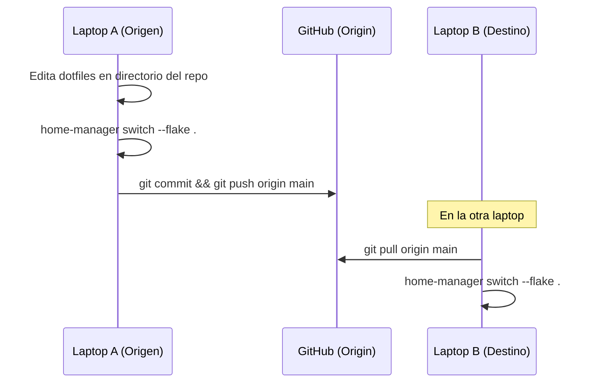

# 07 — Runbooks y Procedimientos Operativos (SOP)

Este documento contiene los manuales de procedimiento estándar (*Standard Operating Procedures*) para la administración de las laptops.

---

## Runbook 1: Aprovisionamiento de una Laptop desde Cero

Sigue estos pasos en una máquina recién formateada con Debian GNU/Linux:

### Paso 1: Asignar Hostname y Resolución Local
Identifica si la máquina será `jorge-secundaria`, `jorge-terciaria` o un nuevo host:
```bash
# Ejemplo para jorge-secundaria:
sudo hostnamectl set-hostname jorge-secundaria
sudo sed -i 's/127.0.1.1.*/127.0.1.1\tjorge-secundaria/' /etc/hosts
```

### Paso 2: Clonar Repositorio y Aprovisionar Sistema Base
```bash
DOTFILES_DIR="${DOTFILES_DIR:-$HOME/dotfiles-nix}"
git clone https://github.com/JorgeDoicela/dotfiles-nix.git "$DOTFILES_DIR"
cd "$DOTFILES_DIR"
sudo bash ./setup/instalar.sh
```
*Este paso configurará repositorios, llaves GPG, TLP para batería, GRUB silencioso, servicios de GPU AMD y paquetes base.*

### Paso 3: Instalar Nix (Determinate Systems Installer)
Ejecuta el instalador oficial recomendado:
```bash
sh <(curl -L https://install.determinate.systems/nix) install
```
*Cierra y reabre tu terminal o ejecuta `source /nix/var/nix/profiles/default/etc/profile.d/nix-daemon.sh` para cargar las variables.*

### Paso 4: Desplegar el Perfil Declarativo de Home Manager
```bash
# Desde el directorio del repositorio:
# Para la laptop jorge-secundaria:
nix run github:nix-community/home-manager -- switch --flake .#jorge@jorge-secundaria

# Para la laptop jorge-terciaria:
nix run github:nix-community/home-manager -- switch --flake .#jorge@jorge-terciaria
```

---

## Runbook 2: Agregar una Nueva Laptop al Repositorio

Si incorporas un nuevo equipo (por ejemplo, `jorge-cuarta`):

1. **Crear la estructura del host:**
   ```bash
   mkdir -p hosts/jorge-cuarta
   ```
2. **Definir la configuración del host ([hosts/jorge-cuarta/default.nix](../hosts)):**
   ```nix
   { config, pkgs, ... }:
   {
     mySystem = {
       fontSize = 11;
       cursorSize = 24;
       waybarFontSize = "13px";
       rofiFontSize = "10";
       rofiWidth = "600px";
       rofiHeight = "350px";
       browserScale = "1";
     };

     xdg.configFile."hypr/monitors.conf".source = ./monitors.conf;
     xdg.configFile."waybar/config.json".source = ./config.json;
   }
   ```
3. **Crear `monitors.conf` y `config.json`:**
   Configura la resolución nativa de la pantalla interna y el estilo de la barra Waybar según las características del nuevo equipo.
4. **Registrar el host en [flake.nix](../flake.nix):**
   ```nix
   "jorge@jorge-cuarta" = home-manager.lib.homeManagerConfiguration {
     inherit pkgs;
     modules = [
       ./home.nix
       ./hosts/jorge-cuarta
     ];
   };
   ```
5. **Verificar que la sintaxis sea correcta:**
   ```bash
   nix flake check .
   ```

---

## Runbook 3: Flujo Diario de Sincronización GitOps

Para mantener todas las laptops sincronizadas y evitar derivas de configuración:



1. Realiza los cambios en tu laptop actual.
2. Aplica y prueba localmente desde el repositorio con:
   ```bash
   home-manager switch --flake .
   ```
3. Sube los cambios a Git:
   ```bash
   git add .
   git commit -m "feat(modulo): descripcion concisa del cambio"
   git push origin main
   ```
4. En tus demás laptops, simplemente ejecuta desde el repositorio:
   ```bash
   git pull origin main
   home-manager switch --flake .
   ```
   *Home Manager recargará automáticamente los servicios de usuario de systemd (como `rclone-gdrive.service`). Para verificar el estado:*
   ```bash
   systemctl --user status rclone-gdrive.service
   ls -la ~/Drive
   ```
   *Si deseas sincronizar tus carpetas locales offline (ej. Obsidian):*
   ```bash
   sincro
   ```

---

## Runbook 4: Rollback y Limpieza del Nix Store

### Revertir a una Generación Anterior (Rollback)
Si un cambio introducido rompe algún componente visual o funcionalidad:
```bash
# Listar las generaciones anteriores registradas:
home-manager generations

# Activar una generación específica anterior:
/nix/store/<hash>-home-manager-generation/activate
```

### Liberar Espacio en Disco (Garbage Collection)
Con el tiempo, el Nix Store retiene paquetes de generaciones anteriores. Para eliminarlos y recuperar espacio:
```bash
# Eliminar generaciones anteriores y limpiar paquetes huérfanos:
nix-collect-garbage -d
```
