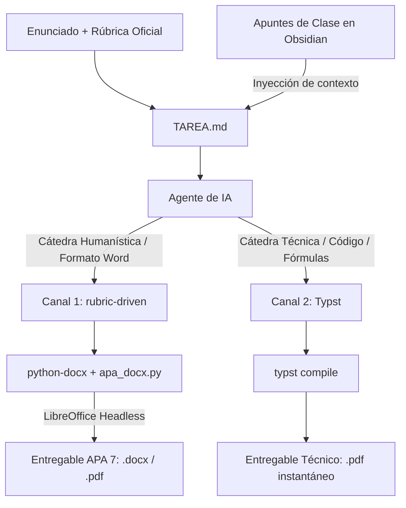

# 09 — Pipeline Documental Académico y Asistencia por IA

Este documento detalla la arquitectura de generación de tareas, el modelo bicanal de producción documental y la integración del kit `rubric-driven` para la carrera de **Ingeniería en Inteligencia Artificial y Ciberseguridad** en la **Universidad Bolivariana del Ecuador (UBE)**.

---

## 1. Visión y Principios de Diseño

El sistema transforma la producción de entregables universitarios en un flujo de ingeniería asistido por agentes de IA bajo los siguientes principios:

1. **Rigor de Evaluación (Rubric-Driven):** Ningún documento se redacta sin antes mapear todos los criterios y ponderaciones de la rúbrica de la cátedra.
2. **Contextualización Directa (Obsidian RAG):** Se suministran las notas de clase reales tomadas en Obsidian (`~/Documentos/Vida de Jorge/...`) al agente de IA para forzar la adopción del vocabulario, teoremas y metodología del docente, eliminando alucinaciones genéricas.
3. **Evidencia Auténtica:** Se prohíbe la simulación de pruebas; los resultados de terminal, capturas de red y auditorías de memoria provienen de ejecuciones reales del sistema.
4. **Reproducibilidad Inmutable:** El entorno de compilación tipográfica y ofimática se gestiona de forma declarativa mediante Nix Flakes.

---

## 2. Arquitectura de Generación: Modelo Bicanal

Se establece una división estricta en dos canales de salida según la naturaleza de la asignatura, descartando herramientas intermedias redundantes como Pandoc:



### Canal 1: Ofimática Formal (`rubric-driven` + `python-docx`)
* **Uso:** Asignaturas como *Comunicación y Comprensión Lectora* o materias donde el docente exige obligatoriamente formato Word (`.docx`) y normas APA 7 estrictas.
* **Componentes:**
  * Motor: Scripts Python que importan `_plantillas/apa_docx.py`.
  * Conversor a PDF: `LibreOffice` ejecutado en modo silencioso (`soffice --headless`) mediante `_plantillas/tareas.py pdf <carpeta>`.
  * Integración en dotfiles: Declarado en [modules/apps.nix](../modules/apps.nix) con entradas de escritorio ocultas (`NoDisplay=true`) para operar exclusivamente como backend desatendido.

### Canal 2: Tipografía Científica (`Typst`)
* **Uso:** Asignaturas técnicas de ingeniería (*Representación del Conocimiento, Análisis de Problemas/Algoritmos, Redes, Sistemas Operativos, Programación Estructurada*).
* **Componentes:**
  * Motor: Binario declarativo `typst` gestionado por Nix Flakes en [modules/apps.nix](../modules/apps.nix).
  * Plantilla: `plantilla_ingenieria.typ` con portada formal de la UBE, resaltado de código en C/Python/Bash, fórmulas matemáticas y tabla de contenidos.
  * Ventaja: Compilación sub-segundo (menor a 30 ms) sin el peso ni la fragilidad de LaTeX.

---

## 3. Estructura del Ecosistema de Agentes (`.agents`)

Para automatizar la resolución asistida, se estructuró la carpeta `.agents` con la siguiente jerarquía operativa:

```text
.agents/
├── AGENTS.md                  # Protocolo de ingeniería, reglas de rúbrica y rastro cero en Git
├── memory/
│   ├── contexto_estudiante.md     # Perfil de Jorge Doicela, UBE y rutas locales
│   ├── materias_primer_periodo.md # Diagnóstico de las 6 materias del semestre
│   └── convenciones_academicas.md # Normas APA 7 y lineamientos de código
└── skills/
    ├── resolver-tarea/        # Flujo operativo SOP para ingestión, redacción y auditoría
    ├── apa7-docx/             # Catálogo de funciones para python-docx y apa_docx.py
    └── typst-ingenieria/      # Guía técnica y plantilla institucional (plantilla_ingenieria.typ)
```

---

## 4. Almacenamiento y Sincronización Declarativa (`sincro`)

La gestión física de carpetas académicas sigue una separación limpia:

1. **Kit de Automatización:** `/home/jorge/Escritorio/Proyectos/rubric-driven`
   * Repositorio Git donde residen las herramientas, plantillas y carpetas locales de tareas (`materias/`).
   * La carpeta `materias/` permanece ignorada en `.gitignore` para garantizar rastro cero en repositorios públicos.
2. **Carpeta de Entrega Universitaria:** `/home/jorge/Escritorio/UBE`
   * Directorio local para almacenamiento de entregables, enunciados consolidados y material oficial de la UBE.
3. **Respaldo Bidireccional en la Nube:**
   * Configurado en [raw_configs/rclone/sincro-targets.conf](../raw_configs/rclone/sincro-targets.conf):
     ```text
     ube|gdrive:Academico/UBE|$HOME/Escritorio/UBE
     ```
   * Protegido en [raw_configs/rclone/sincro-filters.txt](../raw_configs/rclone/sincro-filters.txt) contra colisiones de archivos temporales ofimáticos (`~$*.docx`, `~$*.pptx`, `~$*.xlsx`) y cachés (`__pycache__`, `.venv`).
